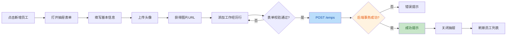
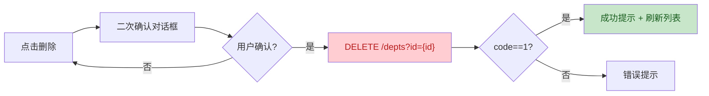

# PRD — Tlias 员工管理系统前端

## 1. 产品概述

Tlias 员工管理系统前端是一套基于 Vue 3 + Element Plus 的中后台管理界面，与现有 Spring Boot 后端（`tlias-web-management`）前后端分离部署，提供**部门管理、员工管理、文件上传**三大核心模块的可视化操作能力。

- **目标用户**：企业 HR、部门管理员、系统运维人员。
- **核心价值**：以表格 / 表单 / 对话框驱动的标准中后台交互，替代后端现有的简陋 `upload.html`，使部门与员工的增删改查、分页筛选、工作经历维护、头像上传全部图形化、高效化。
- **技术定位**：纯前端 SPA，通过 Vite 开发服务器代理对接后端 `http://localhost:8080`，生产构建后由 Nginx 托管并反向代理至后端。

## 2. 核心功能

### 2.1 用户角色

本项目为单角色内部管理系统（无登录鉴权，后端当前未实现 `/login` 接口），所有功能对内部用户开放。

| 角色 | 入口 | 核心权限 |
|------|------|----------|
| 系统管理员 | 直接访问前端首页 | 部门 / 员工 / 文件上传全部读写权限 |

### 2.2 功能模块

1. **部门管理**：部门列表、新增部门、编辑部门、删除部门。
2. **员工管理**：员工分页条件查询、新增员工（含工作经历）、编辑员工、批量删除员工、根据 ID 查询回显。
3. **文件上传**：图片上传、上传结果预览、上传历史记录。

### 2.3 页面详情

| 页面名称 | 模块名称 | 功能描述 |
|----------|----------|----------|
| 部门管理 | 部门列表表格 | 展示全部部门（id / name / createTime / updateTime），支持按更新时间倒序；行内"编辑 / 删除"操作 |
| 部门管理 | 新增部门对话框 | 表单输入部门名称，提交 POST `/depts`，校验非空 |
| 部门管理 | 编辑部门对话框 | 进入前 GET `/depts/{id}` 回显名称，提交 PUT `/depts` |
| 部门管理 | 删除确认 | 二次确认后 DELETE `/depts?id={id}` |
| 员工管理 | 查询条件栏 | 姓名模糊、性别单选、入职日期范围（begin / end）、查询 / 重置按钮 |
| 员工管理 | 员工列表表格 | 分页展示员工（含 id / username / name / gender / image / job / salary / entryDate / deptName / updateTime）；支持多选批量删除；行内"编辑 / 删除" |
| 员工管理 | 分页组件 | Element Plus `el-pagination`，page / pageSize 双向绑定，默认 1 / 10 |
| 员工管理 | 新增员工抽屉 | 表单含基本信息 + 工作经历动态列表（company / job / begin / end），可增删行；头像通过文件上传组件获取 URL；提交 POST `/emps` |
| 员工管理 | 编辑员工抽屉 | 进入前 GET `/emps/{id}` 回显（含 exprList）；提交 PUT `/emps` |
| 文件上传 | 上传卡片 | `el-upload` 拖拽 + 点击上传，POST `/upload`（multipart）；限制类型 jpg/png、大小 10MB |
| 文件上传 | 结果预览 | 上传成功后展示返回的图片 URL 与缩略图；可复制链接 |
| 文件上传 | 上传历史 | 会话内维护已上传记录列表（文件名 / 大小 / 时间 / URL） |

## 3. 核心流程

### 3.1 员工新增流程（含工作经历与头像）

用户点击"新增员工" → 打开抽屉表单 → 填写基本信息 → 通过头像上传组件上传图片得到 URL → 添加若干工作经历行 → 提交 → 后端事务写入 emp 与 emp_expr → 成功提示并刷新列表。

### 3.2 部门删除流程

## 4. 用户界面设计

### 4.1 设计风格

本系统采用"**墨青现代中后台**"风格，区别于 Element Plus 默认蓝色，营造专业、克制、有质感的内部工具气质。

- **主色**：墨青 `#0d9488`（Teal-600），用于主按钮、激活态、品牌色块。
- **辅色**：暖琥珀 `#f59e0b`（Amber-500），用于强调、警告、关键数据高亮。
- **中性色**：石板灰阶 `#0f172a → #e2e8f0`，用于文字层级与背景。
- **背景**：主内容区浅灰 `#f8fafc`；侧边栏深石板 `#0f172a`。
- **按钮风格**：主按钮实心墨青 + 微阴影；次按钮描边；圆角 6px。
- **字体**：标题用 `Sora`（几何现代感），正文用 `Noto Sans SC`（中文清晰）。
- **布局风格**：左侧固定侧边栏 + 顶部面包屑 + 卡片化主内容区。
- **图标**：Element Plus Icons（线性、统一描边）。
- **动效**：表格行 hover 微抬升、抽屉滑入、按钮 press 反馈、加载骨架屏。

### 4.2 页面设计概览

| 页面名称 | 模块名称 | UI 元素 |
|----------|----------|---------|
| 布局框架 | 侧边栏 | 深石板背景、墨青激活高亮、Logo + 菜单（部门 / 员工 / 上传） |
| 布局框架 | 顶部栏 | 面包屑 + 刷新 + 全屏按钮 |
| 部门管理 | 工具栏 | "新增部门"主按钮 + 右侧刷新图标 |
| 部门管理 | 数据表格 | 斑马纹、圆角卡片包裹、行操作按钮组 |
| 员工管理 | 查询栏 | 卡片化表单、网格布局、主次按钮区分 |
| 员工管理 | 数据表格 | 头像圆形缩略图、性别 Tag 着色、职位 Tag、分页右对齐 |
| 员工管理 | 抽屉表单 | 左右两栏基本信息 + 全宽工作经历子表格 |
| 文件上传 | 上传区 | 虚线拖拽框、墨青强调、进度条、成功打勾动画 |
| 文件上传 | 历史列表 | 紧凑表格、缩略图 + 复制按钮 |

### 4.3 响应式

桌面优先（最小 1280px 设计基准）。在 < 992px 时侧边栏可折叠为抽屉模式，表格出现横向滚动。触控优化：按钮最小点击区 40×40。

### 4.4 3D 场景

不适用（纯数据管理界面）。

## 5. 接口对接说明

- 所有接口返回统一 `Result{code,msg,data}`，`code===1` 为成功。
- 分页接口 `data` 为 `PageResult{total,rows}`。
- **文件上传差异提示**：接口文档规定 `POST /upload` 返回 `data` 为图片 URL，但当前后端 `UploadController` 实际返回 `data: null`。前端按文档预期实现（展示 URL），联调时需后端补充返回上传后的可访问 URL（如 `http://localhost:8080/upload/{uuid}.ext`）。
- 跨域：开发期通过 Vite `server.proxy` 代理 `/api` → `http://localhost:8080`，规避浏览器同源策略。
