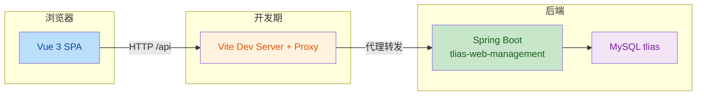
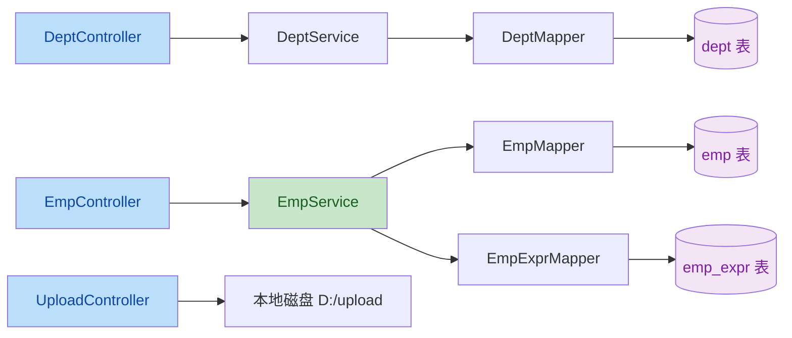
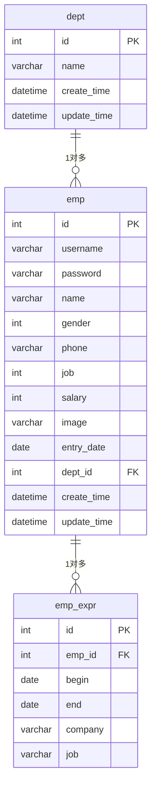

# 技术架构 — Tlias 员工管理系统前端

## 1. 架构设计



## 2. 技术说明

- **前端框架**：Vue 3.4+（Composition API + `<script setup>`）
- **UI 库**：Element Plus 2.x（按需导入 + unplugin-auto-import / unplugin-vue-components）
- **路由**：Vue Router 4（history 模式）
- **状态管理**：Pinia（部门列表缓存、员工查询条件持久化、上传历史）
- **HTTP 客户端**：Axios（统一实例、请求/响应拦截、错误统一处理）
- **构建工具**：Vite 5
- **初始化工具**：`npm create vite@latest tlias-frontend -- --template vue`
- **后端**：Spring Boot 3.4 + MyBatis（已存在，端口 8080）
- **数据库**：MySQL（tlias，已存在）
- **包管理**：npm

## 3. 路由定义

| 路由 | 用途 |
|------|------|
| `/` | 重定向到 `/depts` |
| `/depts` | 部门管理列表页 |
| `/emps` | 员工管理列表页 |
| `/upload` | 文件上传页 |
| `/:pathMatch(.*)*` | 404 兜底页 |

## 4. API 定义

### 4.1 通用类型

```typescript
// 统一响应
interface Result<T = any> {
  code: number      // 1 成功，0 失败
  msg: string
  data: T
}

// 分页响应
interface PageResult<T> {
  total: number
  rows: T[]
}
```

### 4.2 部门模块

```typescript
interface Dept {
  id: number
  name: string
  createTime: string   // "2022-09-01T23:06:29"
  updateTime: string
}

// GET    /api/depts              → Dept[]
// GET    /api/depts/{id}         → Dept
// POST   /api/depts             body: { name: string }
// PUT    /api/depts             body: { id: number, name: string }
// DELETE /api/depts?id={id}
```

### 4.3 员工模块

```typescript
interface EmpExpr {
  id?: number
  empId?: number
  company: string
  job: string
  begin: string       // "2012-07-01"
  end: string         // "2019-03-03"
}

interface Emp {
  id?: number
  username: string
  password?: string
  name: string
  gender: number      // 1 男 2 女
  phone?: string
  job?: number        // 1 班主任 2 讲师 3 学工主管 4 教研主管 5 咨询师
  salary?: number
  image?: string
  entryDate?: string  // "2015-01-01"
  deptId?: number
  deptName?: string
  createTime?: string
  updateTime?: string
  exprList?: EmpExpr[]
}

interface EmpQueryParam {
  page: number
  pageSize: number
  name?: string
  gender?: number
  begin?: string
  end?: string
}

// GET    /api/emps              → PageResult<Emp>
// GET    /api/emps/{id}         → Emp
// POST   /api/emps             body: Emp
// PUT    /api/emps             body: Emp
// DELETE /api/emps?ids=1,2,3
```

### 4.4 文件上传

```typescript
// POST /api/upload  multipart/form-data, field: file
// 响应: Result<string>  data 为图片 URL
```

## 5. 服务端架构图



## 6. 数据模型

### 6.1 数据模型定义



### 6.2 数据定义语言

后端已存在表结构，无需新建。关键表 DDL 摘要：

```sql
-- 部门表
CREATE TABLE dept (
  id          INT UNSIGNED AUTO_INCREMENT PRIMARY KEY,
  name        VARCHAR(20)  NOT NULL UNIQUE,
  create_time DATETIME     NOT NULL,
  update_time DATETIME     NOT NULL
);

-- 员工表
CREATE TABLE emp (
  id          INT UNSIGNED AUTO_INCREMENT PRIMARY KEY,
  username    VARCHAR(20)  NOT NULL UNIQUE,
  password    VARCHAR(32),
  name        VARCHAR(20)  NOT NULL,
  gender      TINYINT,
  phone       VARCHAR(11),
  job         TINYINT,
  salary      INT,
  image       VARCHAR(255),
  entry_date  DATE,
  dept_id     INT UNSIGNED,
  create_time DATETIME     NOT NULL,
  update_time DATETIME     NOT NULL,
  CONSTRAINT fk_emp_dept FOREIGN KEY (dept_id) REFERENCES dept(id)
);

-- 工作经历表
CREATE TABLE emp_expr (
  id      INT UNSIGNED AUTO_INCREMENT PRIMARY KEY,
  emp_id  INT UNSIGNED NOT NULL,
  begin   DATE,
  end     DATE,
  company VARCHAR(50),
  job     VARCHAR(30),
  CONSTRAINT fk_expr_emp FOREIGN KEY (emp_id) REFERENCES emp(id)
);
```

## 7. 前端工程结构

```
tlias-frontend/
├─ index.html
├─ vite.config.js          # 代理 /api → :8080
├─ package.json
├─ src/
│  ├─ main.js              # 注册 ElementPlus / Pinia / Router
│  ├─ App.vue
│  ├─ api/
│  │  ├─ request.js        # axios 实例 + 拦截器
│  │  ├─ dept.js
│  │  ├─ emp.js
│  │  └─ upload.js
│  ├─ router/
│  │  └─ index.js
│  ├─ stores/
│  │  └─ upload.js         # 上传历史
│  ├─ layout/
│  │  └─ index.vue         # 侧边栏 + 顶栏 + 主区
│  ├─ views/
│  │  ├─ dept/index.vue
│  │  ├─ emp/index.vue
│  │  └─ upload/index.vue
│  └─ styles/
│     └─ variables.scss    # 墨青主题变量
```
